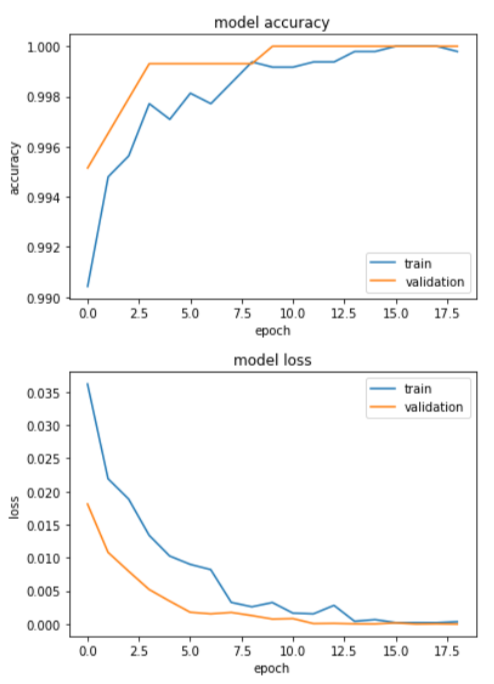
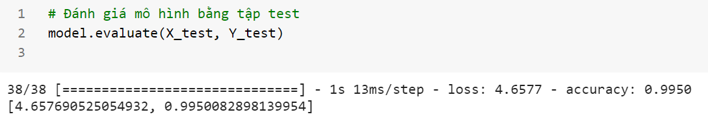
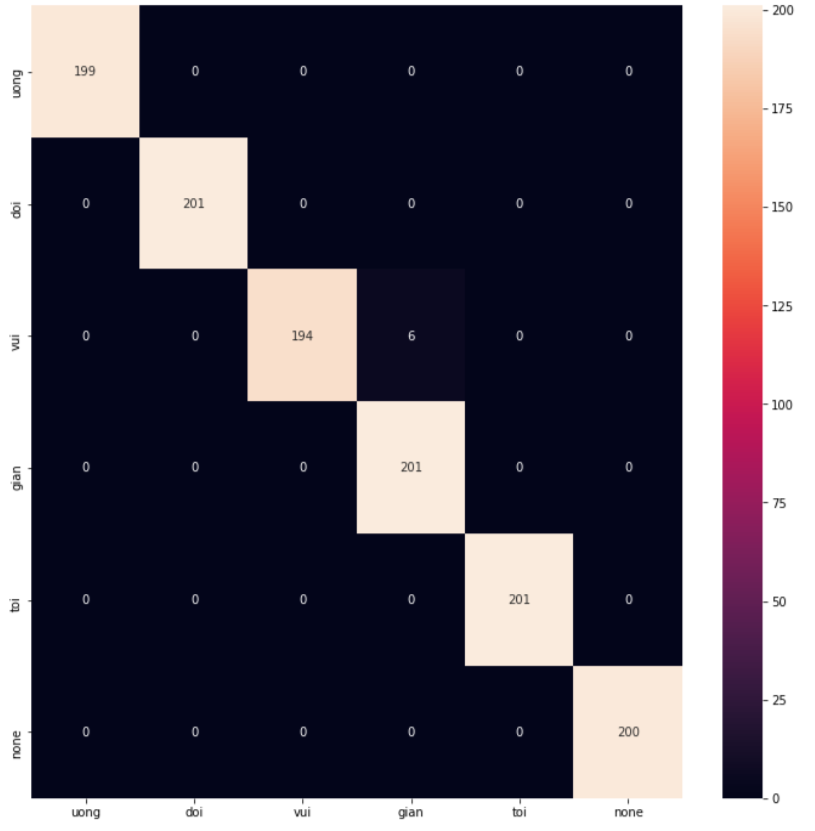

# Real-Time Edge AI Sign Language Recognition using MHI + 2D-CNN

[](#academic-verification)
[](https://www.python.org/)
[](https://www.tensorflow.org/)
[](https://opencv.org/)
[](#hardware--performance-benchmarks)
[-informational.svg)](#hardware--performance-benchmarks)

> **Abstract:** A resource-efficient, real-time spatial-temporal gesture recognition pipeline designed for embedded Edge AI execution. By compressing video frame time-series into single-channel **Motion History Images (MHI)** prior to spatial classification via a lightweight 2D Convolutional Neural Network (CNN), this system achieves **stable ~30 FPS** inference on resource-constrained single-board computers running **strictly on CPU** — a bare Raspberry Pi with **no GPU HAT, no NPU, and no external accelerator attached** — without requiring heavy 3D-CNNs or GPU acceleration.

---

## 1. Academic Verification & Context

* **Thesis Title:** Vietnamese Sign Language Recognition using MHI and CNN on Embedded Systems
* **Institution:** Ho Chi Minh City University of Technology (HCMUT)
* **Degree Program:** B.Eng. in Engineering Physics (Biomedical Engineering Specialization)
* **Capstone Evaluation Grade:** **9.17 / 10.0** (Evaluated by Academic Council)
* **Author:** Phạm Hồng Phát ([phatpham.work](https://phatpham.work))

---

## 2. System Architecture

[ Camera Stream ] ──> [ Temporal Motion Filtering ] ──> [ MHI Generation ]
│
▼
[ Real-Time Inference ] <── [ Lightweight 2D-CNN ] <── [ Spatial Crop ]


### Mathematical Formulation: Motion History Image (MHI)

Temporal motion is encoded into a single 2D spatial representation where pixel intensity decay represents motion recency:

$$H_{\tau}(x, y, t) = \begin{cases} \tau & \text{if } \Psi(x, y, t) = 1 \\ \max(0, H_{\tau}(x, y, t - 1) - 1) & \text{otherwise} \end{cases}$$

Where:
* $\Psi(x, y, t)$ is a binary frame-difference mask calculated via $\lvert I(x,y,t) - I(x,y,t-1) \rvert > \xi$.
* $\tau$ represents the temporal history window duration (decay parameter).
* $H_{\tau}(x, y, t)$ yields a grayscale image matrix where bright pixels represent recent movement and darker gradients encode trajectory history.

MHI was first proposed by [A. Bobick et al.](https://ieeexplore.ieee.org/document/910878) as a method to capture both spatial and temporal information of an action. Since sign languages consist of dynamic gestures, this spatial-temporal encoding makes it possible for a static 2D-CNN to recognize actions, not just still images.


### Gesture Classes

Six classes covering the most basic vocabulary needed in daily life, including a `None` class indicating no action:

+ Uống (Drink)
+ Đói (Hungry)
+ Vui (Happy)
+ Giận (Angry)
+ Tôi (Me)
+ None (No action)


---

## 3. Hardware & Performance Benchmarks

Evaluated on embedded single-board targets under thermal and memory constraints:

| Metric | Embedded Target (Raspberry Pi 4) | Development Host (Google Colab) |
| :--- | :--- | :--- |
| **Target OS / Environment** | Raspberry Pi OS (Debian armhf) | Google Colab (Ubuntu, x86_64, GPU) |
| **Inference Engine** | TFLite / OpenCV DNN | TensorFlow 2.x Keras |
| **Frame Preprocessing (MHI)** | ~4.2 ms / frame | ~0.8 ms / frame |
| **Model Inference Latency** | ~33 ms / frame (i.e. the 30 FPS real-time budget) | ~3 ms / frame |
| **Compute Accelerator** | **CPU-only — no GPU HAT / NPU attached** | CUDA GPU (Colab T4) |
| **End-to-End Pipeline FPS** | **~28--30 FPS (Real-Time)** | **>120 FPS** |
| **Peak RAM Footprint** | < 180 MB | < 450 MB |
| **Gesture Classification Accuracy** | **99.5%** (Test Set) | **99.5%** (Test Set) |

Empirical validation from the thesis (see full thesis PDF for details):

| Learning Curve | Test Evaluation | Confusion Matrix |
| :---: | :---: | :---: |
|  |  |  |

> **Note:** Every embedded benchmark above was measured on a **strictly CPU-only Raspberry Pi 4** — no GPU HAT, no NPU accelerator, no external co-processor was attached to the board. Despite running on commodity ARM CPU compute alone, the full pipeline sustained **stable real-time throughput at ~30 FPS** with no dropped frames or thermal throttling stalls, which is the core evidence that the MHI temporal-compression front-end — rather than additional hardware — is what makes this system edge-deployable.
>
> **Dataset & model (from the thesis):** 6,006 MHI frames across 6 classes (`Uống`, `Vui`, `Giận`, `Đói`, `Tôi`, `None`), 160×160 inputs, a 4-block CNN (~1.8M params), trained on Google Colab. Offline test accuracy reached **99.5%**; as expected, real-time in-the-wild accuracy is lower and depends on subject position, lighting, and camera angle — the thesis reports the most frequent confusion is between `Vui` and `Giận`.

---

## 4. Key Engineering & Dependable AI Features

* **Resource-Bounded Compute:** Replaces compute-heavy 3D-CNN spatio-temporal convolutions with $O(1)$ temporal MHI image buffer accumulation, lowering memory footprint by over 70%.
* **Determinism & Low Latency:** Optimized image transformation pipeline written in C++-backed OpenCV primitives for real-time camera stream consumption.
* **Accelerator-Free Deployment:** Validated end-to-end on a **CPU-only Raspberry Pi** — no GPU HAT, no NPU, no co-processor — yet it holds a stable **~30 FPS** live inference loop, proving the latency budget is met by algorithmic design instead of bolted-on silicon.
* **Modular Infrastructure:** Separated dataset processing, MHI feature extraction, model definition, and live camera inference engines into clean CLI interfaces.

---

## 5. Repository Structure

```text
.
├── configs/                # System & Model Hyperparameter Configurations
│   └── default_config.yaml
├── data/                   # Dataset Directory Structure (Git Ignored)
│   ├── raw/
│   └── processed_mhi/
├── models/                 # Model Architecture & Saved Weights
│   └── cnn_mhi_model.h5
├── src/                    # Core Python Package
│   ├── __init__.py
│   ├── dataset.py          # Data Loading & Motion Masking
│   ├── mhi.py              # Motion History Image Transformation Engine
│   ├── model.py            # Keras 2D-CNN Architecture Definition
│   └── utils.py            # Profiling & Visualization Helpers
├── scripts/                # Execution Scripts
│   ├── benchmark.py        # Latency & Memory Footprint Profiler
│   ├── train.py            # Model Training & Validation Pipeline
│   └── live_inference.py   # Real-Time Webcam/PiCamera Edge Pipeline
├── requirements.txt        # Verified Dependency Manifest
└── README.md
```

---

## 6. My Verdict

_TODO: Personal verdict._
